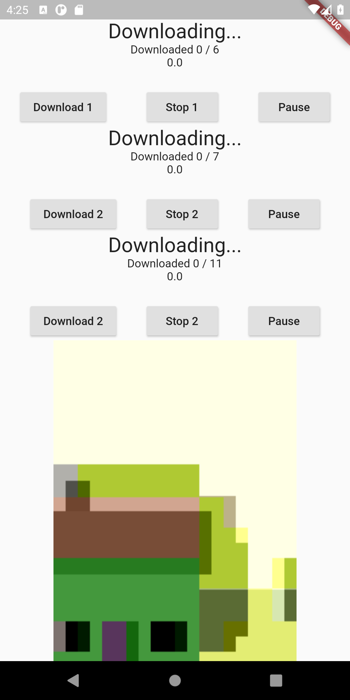
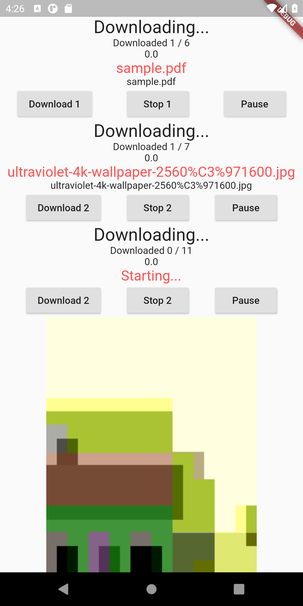
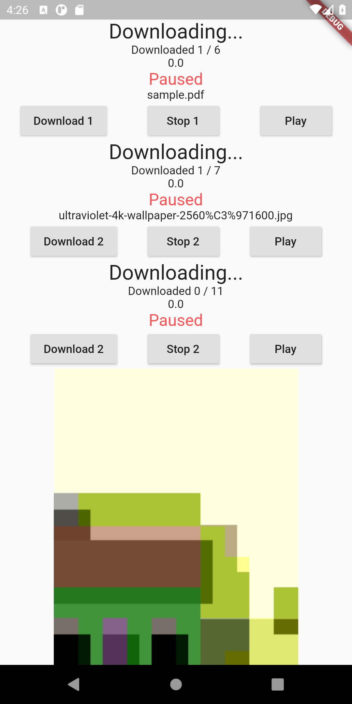
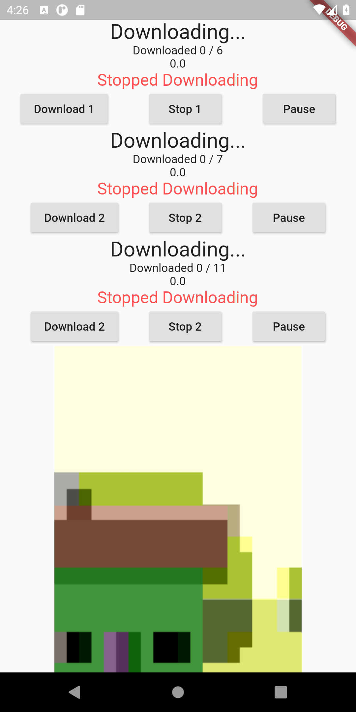

# download_isolate

# Features:
### 1. Download control : Start, Stop, Pause, and resume.
### 2. Downloading from Multiple lists at same time.
### 3. Downloading all kind of files from url and storing in phone storage at folder name "MFile" with file name extracted from URL itself.
### 4. Camera view to make app heavy

  
- [Lab: Write your first Flutter app](https://flutter.dev/docs/get-started/codelab)
- [Cookbook: Useful Flutter samples](https://flutter.dev/docs/cookbook)

For help getting started with Flutter, view our
[online documentation](https://flutter.dev/docs), which offers tutorials,
samples, guidance on mobile development, and a full API reference.
